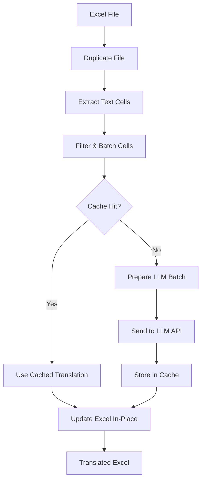

# Excel Translation MCP Server Plan

## Core Architecture

### 1. Implementation Structure

```
excel-translation-mcp/
├── excel_translator.py       # Core translation engine
├── mcp_server.py             # MCP server with FastMCP
├── cache_manager.py          # Redis + PostgreSQL caching
├── llm_providers.py          # Multiple LLM support
├── config.py                 # Enhanced configuration
├── requirements.txt          # Updated dependencies
├── test_simple.py            # Simple test cases
├── docker-compose.yml        # Infrastructure setup
└── docs/plan.md              # This planning document
```

### 2. Key Components

**Core Translator**
- Uses openpyxl for **in-place translation**
- Processes Excel sheet-by-sheet, batch-by-batch
- Maintains original formatting, formulas, and styles

**LLM Integration**
- Supports OpenAI, Anthropic, Ollama, OpenRouter
- Batch 20-50 cells per API call to optimize costs
- Smart cell filtering (skip empty, numeric, formula cells)

**Caching System**
- **Redis**: First layer for fast lookups of recent translations
- **PostgreSQL**: Second layer for persistent storage (optional)
- Smart cache keys using cell content + context hash

**MCP Server**
- Implements official MCP Python SDK
- Exposes translation tools via MCP protocol

### 3. Translation Workflow



## Implementation Details

### Efficient LLM Data Format

Request Format:
```json
{
  "translations": [
    {"id": "Sheet1!A1", "context": "Column header", "text": "改訂履歴"},
    {"id": "Sheet1!B1", "context": "Column header", "text": "Ver-ID"}
  ],
  "batch_id": "batch_123",
  "metadata": {
    "file_hash": "abc123",
    "sheet_name": "Sheet1"
  }
}
```

Response Format:
```json
{
  "translations": [
    {"id": "Sheet1!A1", "text": "Revision History"},
    {"id": "Sheet1!B1", "text": "Version ID"}
  ],
  "batch_id": "batch_123",
  "tokens_used": 1250
}
```

### Configuration Options

```python
class Config:
    DEFAULT_BATCH_SIZE = 50        # Cells per LLM call
    MAX_TOKENS_PER_CALL = 4000    # Token limit
    CACHE_TTL = 86400             # 24h cache expiry
    SUPPORTED_LLMS = [
        'openai', 'anthropic',
        'ollama', 'openrouter'
    ]
```

## Testing Strategy

1. **Unit Tests**: Validate core translation functions
2. **Simple Excel**: 3x3 grid with Japanese text
3. **Complex Excel**: Current K3NF file with mixed content
4. **Performance**: Test with 10,000 cell documents
5. **MCP Integration**: Test with MCP client tools

## Next Steps

1. Create the core translation engine with batch processing
2. Implement multi-layer caching system
3. Build MCP server interface
4. Create test cases and validate
5. Optimize for performance and memory usage
